# A Comprehensive Data Analysis on a WhatsApp Group Chat

- Have a look at a **detailed [Medium Article](https://medium.com/@tusharnankani/an-exhaustive-whatsapp-chat-data-analysis-f8421a845c30)** for this project!
- [Whatsapp Chat Data Analysis - Notebook on GitHub](https://github.com/tusharnankani/whatsapp-chat-data-analysis/blob/main/whatsapp-data-analysis.ipynb)

If the Notebook fails to load:
- Check the complete code, on [this basic HTML Page](https://tusharnankani.github.io/whatsapp-chat-data-analysis/).
- [Whatsapp Chat Data Analysis - Notebook on Jovian](https://jovian.ml/tusharnankani3/whatsapp-data-analysis)

## *Overview*

- [Introduction](#introduction)
- [Data Retrieval & Preprocessing](#data-retrieval--preprocessing)
- [Exploratory Data Analysis](#exploratory-data-analysis)
- [Data Visualization]
- [Data Interpretation]
- [Summarizing the Inferences]
- [Conclusion](Conclusion)

# *Introduction*:

Whatsapp has quickly become the world’s most popular text and voice messaging application. Specializing in cross-platform messaging with over 1.5 billion monthly active users, this makes it the most popular mobile messenger app worldwide.

- I thought of various projects on which I could analyse data like - *Air Quality Index* or The *cliched* *Covid-19 Data Analysis*.

- But I thought why not do **Data Analysis on a WhatsApp group chat** of *college students* and find out interesting insights about *who is most active, who are ghosts (the ones who do not reply), my sleep schedule,* *the most used emoji, the most actives times of the day, or does the group use phones during college teaching hours?* 

- These would be some interesting insights for sure, more for me than for you, since the people in this chat are people I know personally.

# *Data Retrieval & Preprocessing*
### Beginning. How do I export my conversations? From Where To Obtain Data?

- The first step is **Data Retrieval & Preprocessing**, that is to **gather the data**. WhatsApp allows you to **export your chats** through a **.txt format**. 

- Go to the respective chat, which you want to export!

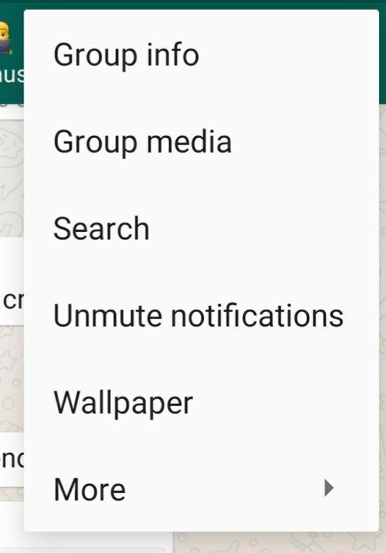

- Tap on **options**, click on **More**, and **Export Chat.**

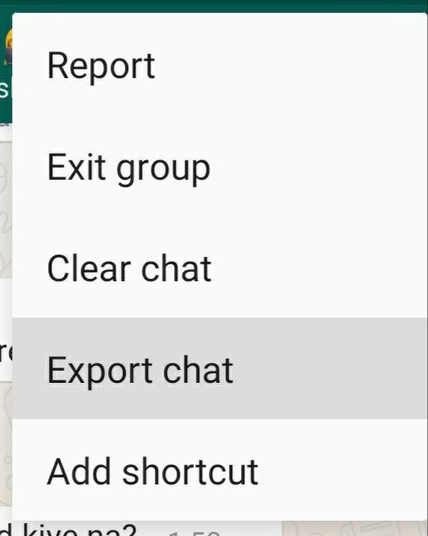

- I will be Exporting **Without Media.**

#### NOTE:
- Without media: exports about **40k messages **
- With media: exports about *10k messages along with pictures/videos* 
- While exporting data, *avoid including media files* because if the number of media files is greater than certain figure then not all the media files are exported.

## Opening this .txt file up, you get messages in a format that looks like this:

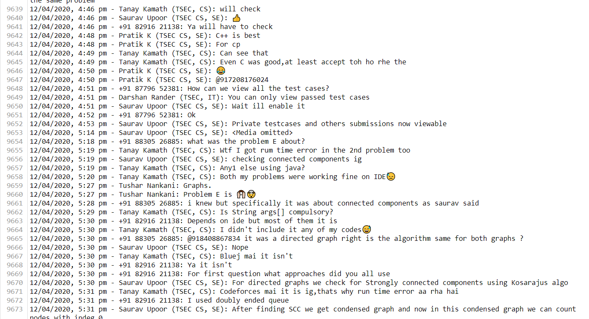

# *Exploratory Data Analysis*

### *Importing Necessary Libraries*

We will be using :
1. **Regex (re)** to extract and manipulate strings based on specific patterns.
    - References:
        - [Regex - Python Docs](https://docs.python.org/3/library/re.html)
        - [Regex cheatsheet](https://www.rexegg.com/regex-quickstart.html)
        - [Regex Test - live](https://regexr.com/)
        - [Datetime Format](http://strftime.org/)
2. **pandas** for analysis.
3. **matlotlib** and **seaborn** for visualization.
4. **emoji** to deal with emojis.
    - References:
        - [Python Docs](https://pypi.org/project/emoji/)
        - [Emoji](https://github.com/carpedm20/emoji)
        - [EMOJI CHEAT SHEET](https://www.webfx.com/tools/emoji-cheat-sheet/)
5. **wordcloud** for the most used words.
6. **datetime** for datetime manipulation.

### *Preparation and reading data*

Since WhatsApp texts are multi-line, you cannot just read the file line by line and get each message that you want. Instead, you need a way to identify if a line is a new message or part of an old message. You could do this use regular expressions, but I went forward with a more simple method, which splits the time formats and creates a DataFrame from a Raw .txt file.

While reading each line, I split it based on a comma and take the first item returned from the `split()` function. If the line is a new message, the first item would be a valid date, and it will be appended as a new message to the list of messages. If it’s not, the message is part of the previous message, and hence, will be appended to the end of the previous message as one continuous message.

# *Pre-Processing*

Firstly, let’s load our .txt into a DataFrame.

The dataset now contains 3 columns - DateTime String, User, and Message sent and their respective entries in 13655 rows.

**Let’s create some helper columns for better analysis!**

Now that we have a clean DataFrame to work with, it’s time to perform analysis on it. **Let’s start Visualizing!**

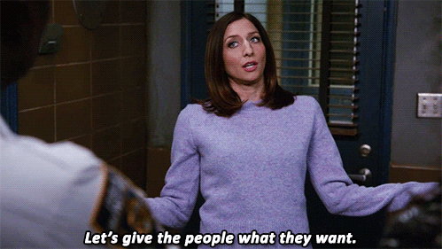

# *Exploratory Data Analysis*

At this point, I think I’m ready to start my analysis so I will plot a simple line graph to see the frequency of messages over the months. 

### The overall frequency of total messages on the group

I expect to see a nice line graph with crests and troughs in odd places.

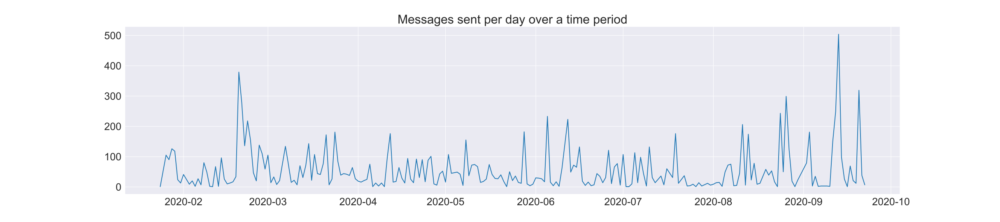

### Top 10 Most Active Days
Grouping the data set by date and sorting values according to the number of messages per day.

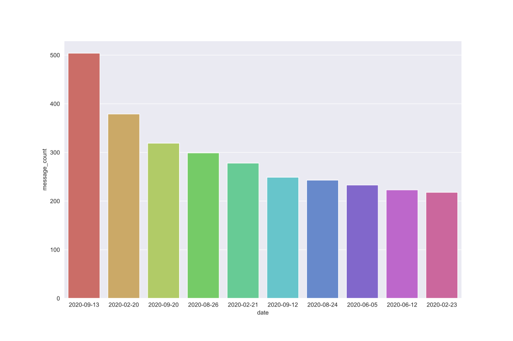

Apparently, the group was very active on 13th September’20 because we were discussing fundamental yet tricky and brain-wracking “Guess the Output” Java questions!

### Top 10 active users on the group

Before analyzing, the top users, let’s find out how many ghosts are there in the group!

#### Shocking Result

- Total number of people who have sent at least one message on the group is 154.
- BUT, the total number of participants are 237.
- That means **81** people in the group have **not sent even a single message throughout these 9 months and 13500+ messages**.

### Now, *pre-processing the top 10 active users.*

Grouping the dataset by the user, and sorting according to the message count.

And, we will be *replacing names by their initials* for **Better Visualization**, and also to maintain anonymity.

Also, I will be customizing the styles for **Better Visualization and More Readability** using *matplotlib*.

**My first plot will be the total number of messages sent per person.** For this, a simple *seaborn countplot* will suffice.

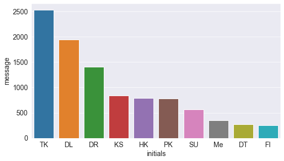

**TK** beats everyone by a mile, with **2500+ messages**, followed by **DL** with around **2000 messages**.

#### But here comes the twist!

Now, I will plot the **Average Message Length of the messages sent by the Top 10 most active users**. *Let’s see the results now!*

### *Comparing the top 10 users!*

Now, first things first, since almost all the plots will be *comparing one person with another*, I’ll assign a **specific color to each person** so that it becomes **easy to identify each person among multiple plots**.

I could’ve used *seaborn’s color palette* but:

— Seaborn assigns *default colors* itself, but I wanted ***the color of a certain person to remain the same, no matter the plot.***

— Also, I wanted to try some different colors so I grabbed my color palette from [this website](https://coolors.co/).
#### Defining a function to tackle the problem.

I’m defining this function ***to maintain consistent colors for each person across all plots***. Since the order will vary depending on the plot, this is passed to the function which will *reorder colors in a particular order so that the color of a certain person remains the same no matter the plot*. This will help maintain ***consistency and readability*** amongst the many graphs I will be plotting.

Next, I made a dictionary where **each key is the name and the value for each would be their assigned color**. I create a function that reorders colors given a list of names to match the ordering of the plot. 

This function takes the ordered names as input and returns a reordered list of colors. This list has to be passed into the **`palette`** argument in a **seaborn plotting function.**

Now we have a *nice set of colors for each person* which we can visualize using **palplot**.

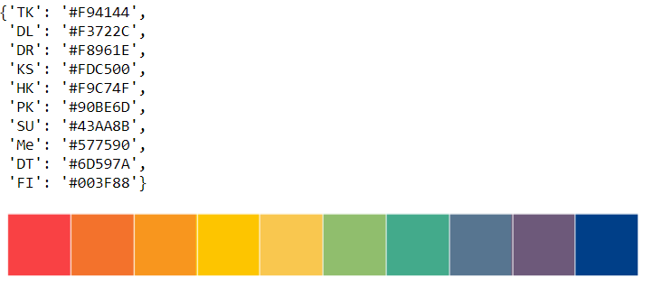

The next one would be the average message length for each person. For this, I create a new column called `message_length` which contains the length of each message which I get by using a lambda function which returns the length of a given message. I just group the DataFrame by name and then apply `mean()` on the returned groupby object.

- **Plotting multiple charts in a grid**

Matplotlib and Seaborn also support plotting multiple charts in a grid, using `plt.subplots`, which returns a set of axes that can be used for plotting.

#### Let’s see the plots, simultaneously for **some interesting results**!

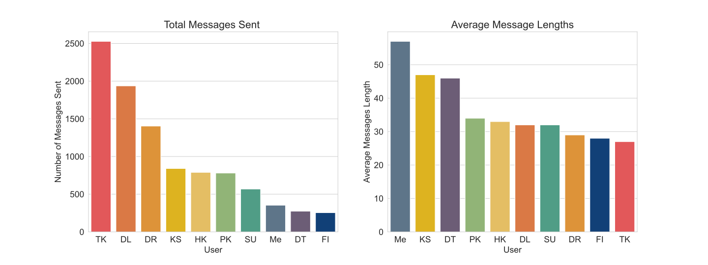

It’s really interesting to see plots like this side by side, because here comes the twist:

- Ironically, TK, the person who sent the **most amount of texts** (2000+), has the least messages’ length on average. This means this person sends broken and many WhatsApp messages in one go.

Here is a snippet of how TK sends messages:

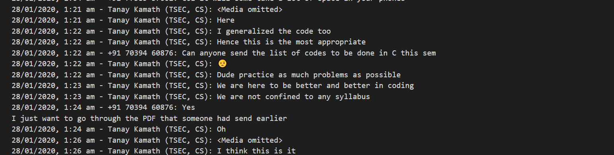

- Also, we can see that, I have sent *less number of messages (7th) on average* while having a ***relatively longer message length (1st)***.

Alright, moving on to a more detailed analysis of the dataset!

## The Top 10 users who send the most media

The exported chats were exported without any media files. Any message that contained media was indicated with *‘<Media Omitted> ’*. **We can use this to filter out and see who sends the most media.**

### Which user sends the most media?
Again, a simple plot using seaborn, but a different Color Palette: *CMRmap*.

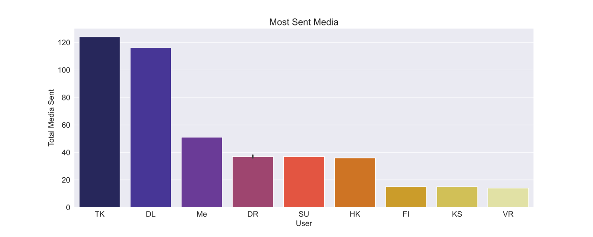

**TK and DL** are beating everyone by a *huge margin*. They, also rank the *top in total messages*, though *last in average message length*. ***Most dedicated contributor award goes to TK and DL!***

## Top 10 most used Emojis

Will be using the `emoji` module, that was imported earlier.

Will create another helper column using `emoji.demojize("<emoji>")`, since **emojis will not be rendered in the plots**.

Since the emojis **will not be rendered into the plots**, here is how the *top10emojis dataset looks like*!

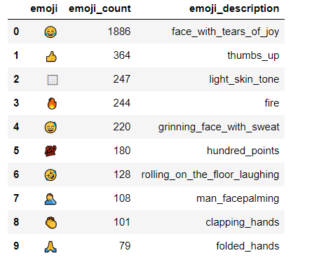

### Which Emoji is the most used in the chat?

This time, it will be plotted a bit differently. Numbers will be plotted on x-direction.

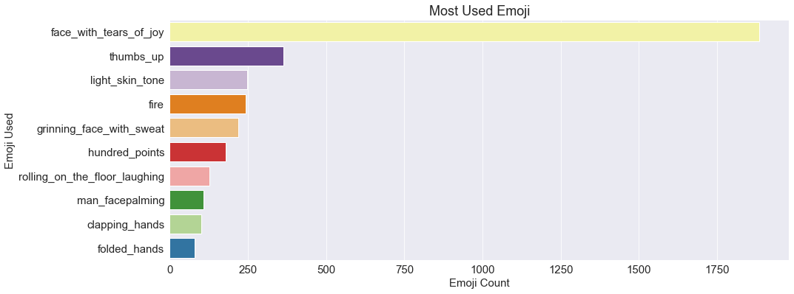

- Not that it is worth anything, but “😂” beats everyone by a *huge margin!*

## Most active days, most active hours, most active months.

Now, I will be analyzing the timely usage of the groups.

#### Pre-processing for most active hours.

### Which hour of the day are most messages exchanged?

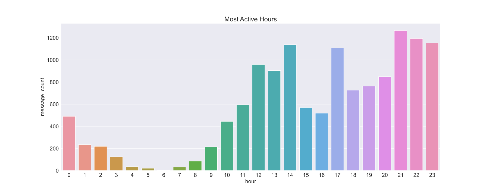

Interestingly, the group is most active around **midnight**, followed by *afternoon*.

### Pre-processing Weekdays and Months

Now, irrespective of the number of messages per day or month, we want the order to be remain the same, hence we will be using the order argument in seaborn.

- Plotting multiple charts using `plt.subplots`.

### Visualization

Now, we will be plotting ***grouped by day and respective group by month simultaneously***, to see some interesting results.

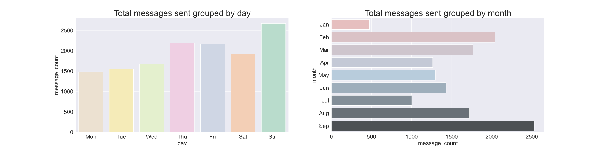

### *Inferences*

- The group is **most active on Sundays**, and **least active on Mondays** (probably *Monday Blues*.)

- Also, **Saturday** has a *minor drop*, this is probably due to the fact that Saturday is the *first weekend after Friday* and people are usually taking a *rest* and doing other activities than messaging on their phones.

- The group has been recently very active, in September.

To get a clearer understanding, we will plot a combined graph — **Heatmap**.

#### Now, we will plot a heatmap, combining the above to bar plots, for a better understanding!

#### Heatmap of Month sent and Day sent

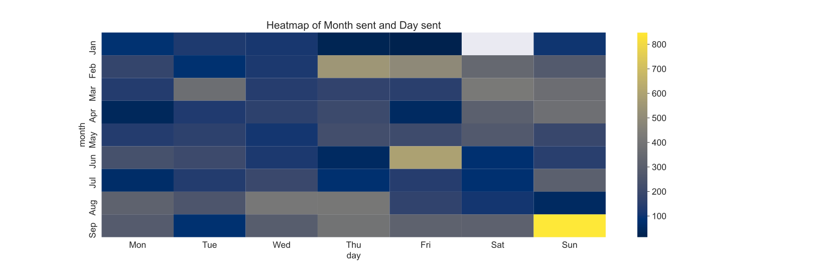

##### Inferences

- The group is more active on weekends, throughout the months.
- September has the most lighter blue shades and more yellow gradients.
- This gives a *combined analysis*, which is really helpful in **real-time projects**.

## Most Used Words in the whole chat.

I will be using the `wordcloud` module, to create a WordCloud of the **most used words**! I will be *adding some common words, to the stopwords*, such that it will not be included the WordCloud.

### Most Used Words in the chat

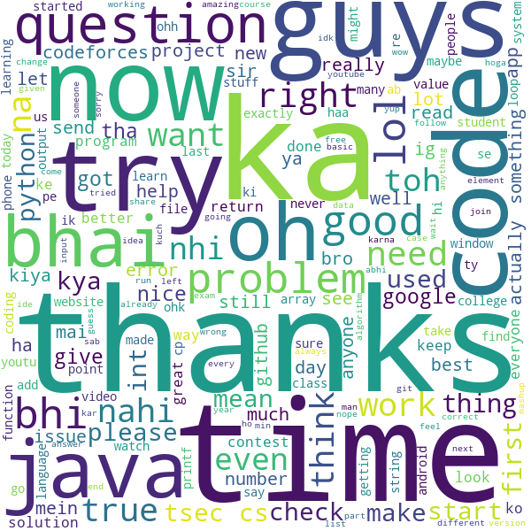

# *Conclusion*

**That’s it from my end! I hope you learned and enjoyed a lot!**

It’s really interesting to see the texting habits of people and incidents of daily life reflected in the text. I suggest you take a look at my code and apply it to your own group chats. However, some modifications will have to be done at the DataFrame creation part. 

If you’re interested, shoot me a message and I’ll help you out.

## Where to go from here?

- Extending this Whatsapp Analysis Project!
    - Adding a **Sentiment Analyser to the texts** — *Swear Words & Sentiments*!
    - Libraries called `profanity_check`, `TextBlob`, `VADER` (Valence Aware Dictionary and Sentiment Reasoner) from NTLK and TextBlob.

- Instagram Data Analysis
- Play Store Data Analysis
- Exploring more datasets! It is never-ending, as there can be **Infinite Stories with Data**!
- Once, done with enough Data Analysis, try making Datasets, scraping Data from websites and creating Interesting Datasets!

> And the best time to do it is right now, today, because tomorrow, typically means never.

***Thank you for reading!*** *Let me know what you thought about this project.*

# Author 
- [Tushar Nankani](https://www.linkedin.com/in/tusharnankani/)